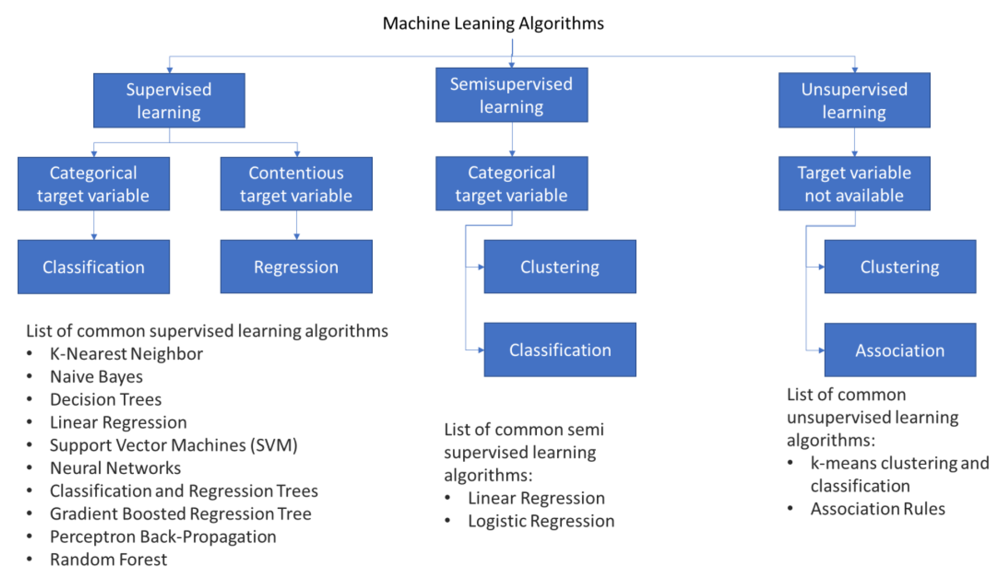

<h1> Machine Learning Model Building Application </h1>

## Table Of Content

- [Table Of Content](#table-of-content)
- [About](#about)
- [Features](#features)
  - [1. Model Building](#1-model-building)
  - [2. Data Exploration](#2-data-exploration)
  - [3. Model Evaluation](#3-model-evaluation)
  - [4. Download and Deploy](#4-download-and-deploy)
- [Usage](#usage)
- [Install and run App locally](#install-and-run-app-locally)
  - [1. Clone the projects repo:](#1-clone-the-projects-repo)
  - [2. Change directory to project directory](#2-change-directory-to-project-directory)
  - [3. Open the project in vs code](#3-open-the-project-in-vs-code)
  - [4. Open vs code terminal and paste the following command](#4-open-vs-code-terminal-and-paste-the-following-command)
  - [5. Install requirements and dependencies.](#5-install-requirements-and-dependencies)
  - [6. Run the Application](#6-run-the-application)
- [Authors](#authors)
- [Acknowledgments](#acknowledgments)
- [License](#license)

## About

<div class="image-container">
    
</div>

<p>
    Welcome to AutoML an application built with the intention of automating the process of building machine learning models without any need of coding. The application is capable of building models for classification and regression problems, with the option of feature engineering and feature selection with techniques like feature scaling and correlation analysis and many more.
</p>
<p>
    Application is built for all the people weather the person is beginner or expert. For using the application the person needs to have just some basic knowledge of classification and regression algorithms, some data-preprocessing steps. That's all you need to know! But for using this application you need to have a data-set.
</p>

- [Visit Application](https://mlmodelbuidlingapp.streamlit.app/)

## Features

### 1. Model Building
- **Choose Algorithms:** Select from a variety of machine learning algorithms, including regression, classification, and clustering algorithms.

- **Hyperparameter Tuning:** Fine-tune your model by adjusting hyperparameter with an intuitive interface.

### 2. Data Exploration
- **Data Visualization:** Explore your dataset through interactive charts and graphs to gain insights.

- **Data Preprocessing:** Handle missing values, scale features, and preprocess data with a few clicks.

### 3. Model Evaluation
- **Performance Metrics:** Evaluate your model's performance using various metrics like accuracy, precision, recall, and more.

- **Confusion Matrix:** Visualize the model's predictions with an interactive confusion matrix.

### 4. Download and Deploy
- **Export Models:** Download your trained model and preprocessor for deployment in real-world applications.

## Usage
1. Upload your dataset.
2. Select the machine learning algorithm and customize hyperparameter.
3. Explore data and preprocess features as needed.
4. Train the model and evaluate its performance.
5. Export the model for deployment.

## Install and run App locally
### 1. Clone the projects repo:
```bash 
git clone https://github.com/rushin236/ML_model_buidling_app
```

### 2. Change directory to project directory
```bash
cd ML_model_building_app
```

### 3. Open the project in vs code
```bash
code .
```

### 4. Open vs code terminal and paste the following command
```bash
conda create -p venv python=3.10 -y
```

### 5. Install requirements and dependencies.
```bash
pip install -r requirements.txt
```

### 6. Run the Application
```bash
streamlit run app.py
```

- **After this you will be prompt to enter your email you can skip it by pressing enter or enter the email if you wish, it is asked by streamlit.**

## Authors
- Rushikesh Shinde - Data Science Post Graduate - All Work

## Acknowledgments
Special thanks to the Streamlit team for providing a powerful framework for building interactive web applications with minimal effort.

Feel free to contribute, report [issues](https://github.com/rushin236/ML_model_buidling_app/issues), or provide feedback. Happy modeling!

## License
- This project is licensed under the MIT License - see the [LICENSE](./LICENSE) file for details.